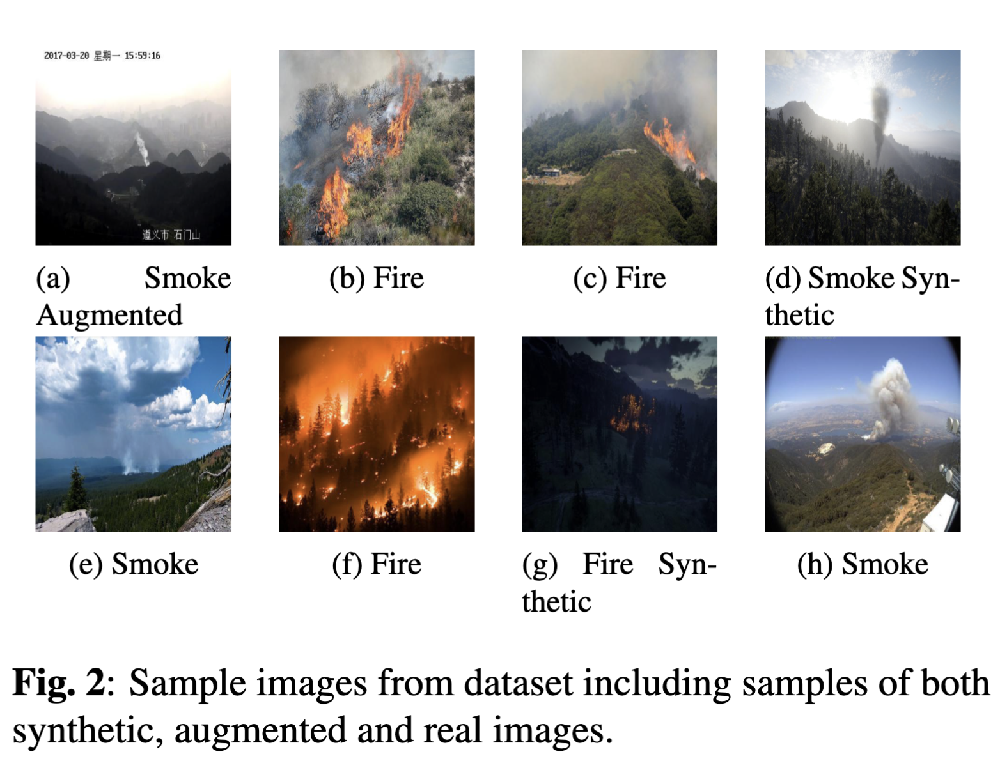
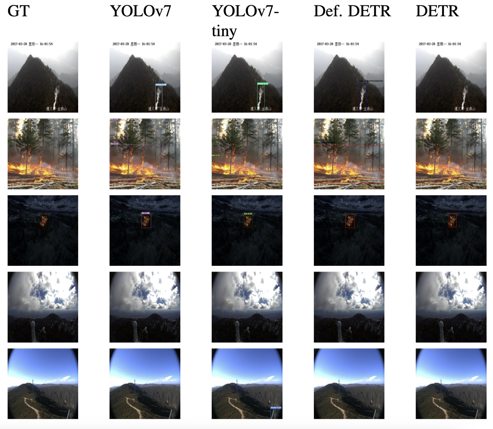

## 🌲 WWF Early-Warning Forest Fire Vision System

### Overview

This repository contains the computer vision and PTZ control modules developed for the *WWF Early-Warning Forest Fire System*.
The project focuses on implementing AI-driven fire detection and real-time camera monitoring to enable early identification of wildfire activity in vulnerable forest regions.

These modules serve as the visual intelligence core of a larger early-warning framework—combining automated image-based fire detection with dynamic camera rotation and calibration for real-time environmental surveillance.
The system was **field-deployed on NVIDIA Jetson Nano hardware**, integrating AI inference with live camera control for real-time forest monitoring.

---

### Datasets

The **Fire and Smoke Detection Dataset** used in this project is publicly available on **Roboflow Universe**:

[**Fire and Smoke Detection Dataset**](https://universe.roboflow.com/sprojfinaldataset/combined-dataset-wfbeb)

This is a **multiclass object detection dataset** containing **8,386 labeled images** across *fire* and *smoke* categories.
All samples were **self-annotated using Roboflow**, with a subset of **synthetically generated images** created specifically for this project to enhance model generalisation and robustness.

  

The dataset integrates and refines samples from multiple open-source sources, including:

* [Forest Fire Dataset (Kaggle – alik05)](https://www.kaggle.com/datasets/alik05/forest-fire-dataset)
* [Forest Fire Dataset (Kaggle – kutaykutlu)](https://www.kaggle.com/datasets/kutaykutlu/forest-fire)
* [Wildfire Smoke Dataset (Roboflow Public)](https://public.roboflow.com/object-detection/wildfire-smoke/1)
* [Wildfire Smoke Dataset (AI for Mankind)](https://github.com/aiformankind/wildfire-smoke-dataset)

By combining, re-annotating, and expanding these resources, the dataset captures a broad range of **real-world environmental conditions** — including varying illumination, haze density, and background complexity — to support accurate detection in challenging visual contexts.

It includes predefined **training**, **validation**, and **test** splits and was used to train and evaluate the YOLOv7 and DeTR/ViT models implemented in this repository.
This dataset forms the foundation for both baseline and refined detection experiments.

---

### System Components

#### Vision-Based Detection Models

This repository implements and evaluates **YOLOv7** and **DeTR / ViT** models for **smoke and fire detection**.
The results demonstrate their effectiveness in identifying wildfire indicators across varying environmental and lighting conditions.

Each model directory contains configuration scripts, pretrained weights (if available), and outputs for both baseline and refined experiments.

  

#### PTZ Camera Calibration & Data Collection

This component handles camera orientation control and data acquisition for live monitoring setups.

**Key Features:**

* Automated pan–tilt–zoom (PTZ) control for forest surveillance.
* Coordinate calibration ensuring consistent camera orientation and accurate region tracking.
* Data collection loop for labeled frame capture during live monitoring.
* Integration-ready interface for coupling camera feeds with detection modules.

These capabilities support dynamic observation, allowing the camera to automatically track suspected fire regions in real time.

---

### Recognition

This project was developed under the *World Wide Fund for Nature (WWF)* initiative on **AI and IoT for forest protection**, focusing on sustainable, technology-driven environmental monitoring.

In recognition of its innovation and impact, the **WWF Early-Warning Forest Fire System** was awarded **Runner-Up** at the **2024 Triple E Awards (Asia-Pacific)** in the *Innovation and Impact in Sustainability* category.
[View Award Details →](https://asia-pacific2024.triple-e-awards.com/finalist/id/995)

#### Related Articles and Reports

* [*Embracing IoT and AI for Forest Protection: Lessons Learned and the Path Forward*](https://medium.com/frontier-technologies-hub/embracing-iot-and-ai-for-forest-protection-lessons-learned-and-the-path-forward-for-the-forest-6c163137c141)
* [*Exploring Technology-Driven Approaches for Early Detection and Response to Forest Fires: The LUMS–WWF Collaboration*](https://medium.com/frontier-technologies-hub/exploring-technology-driven-approaches-for-early-detection-and-response-to-forest-fires-the-lums-955773eb1f56)
* *WWF Asia Report — Natura 50: Edition 4* (2024): [Download PDF](https://wwfasia.awsassets.panda.org/downloads/natura-50-edition-4_compressed--2-.pdf)

---

### License

This project is currently unlicensed and provided solely for research and demonstration purposes.
All rights are reserved by the author. Redistribution, modification, or commercial use of the code is not permitted without explicit permission.

---

### Acknowledgements

This work was developed in collaboration with the **World Wide Fund for Nature (WWF)** and the **Computer Vision and Graphics Lab (CVGL) at LUMS**, as part of a broader initiative on AI and IoT for environmental conservation.
Special thanks to the researchers and engineers at CVGL for their contributions.
